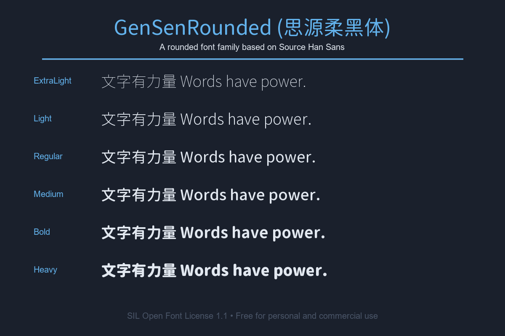

# GenSenRounded (思源柔黑体)

This is a rounded font based on Adobe and Google's [Source Han Sans](https://github.com/adobe-fonts/source-han-sans).

This project is a modification of [GenJyuuGothic](https://github.com/ButTaiwan/genjyuugothic) by But Ko.

> [!NOTE]
> **Disclaimer:** I am not the original author of these fonts. This GitHub repository is a mirror created for my personal convenience to easily access and use these fonts. All credit goes to the original creators.

For the Chinese documentation, please see [README_zh-Hans.md](./README_zh-Hans.md).

## Font Preview

## Font Files

This project contains the following font files:

- `GenSenRounded-B.ttc` (Bold)
- `GenSenRounded-EL.ttc` (ExtraLight)
- `GenSenRounded-H.ttc` (Heavy)
- `GenSenRounded-L.ttc` (Light)
- `GenSenRounded-M.ttc` (Medium)
- `GenSenRounded-R.ttc` (Regular)

## License (SIL Open Font License 1.1)

This font is licensed under the SIL Open Font License 1.1. This is a free and open source font license. Here is a brief summary of the license:

### You are allowed to:

- **Use freely**: Use the font for any personal, academic, or commercial purpose at no cost.
- **Share freely**: Copy and distribute the font files to anyone.
- **Modify freely**: Create derivative fonts based on this font.
- **Bundle with software**: Bundle, redistribute, and/or sell the font with any software, provided that you include the copyright notice and license text.

### You are not allowed to:

- **Sell the font by itself**: You cannot sell the original or modified font files on their own.
- **Use Reserved Font Names**: Any modified version cannot use the Reserved Font Name(s) like "Source" without explicit written permission from the copyright holder.
- **Use other licenses**: Modified fonts must also be distributed under the SIL Open Font License 1.1 and cannot be released under any other license.

> [!IMPORTANT]
> Any document created using this font (e.g., designs, PDF documents, websites, or images) is **not** subject to the terms of this license. You are free to use, publish, and own your own creative work.

For detailed license information, please refer to the `SIL_Open_Font_License_1.1.txt` and `LICENSE_OFL.txt` files.
