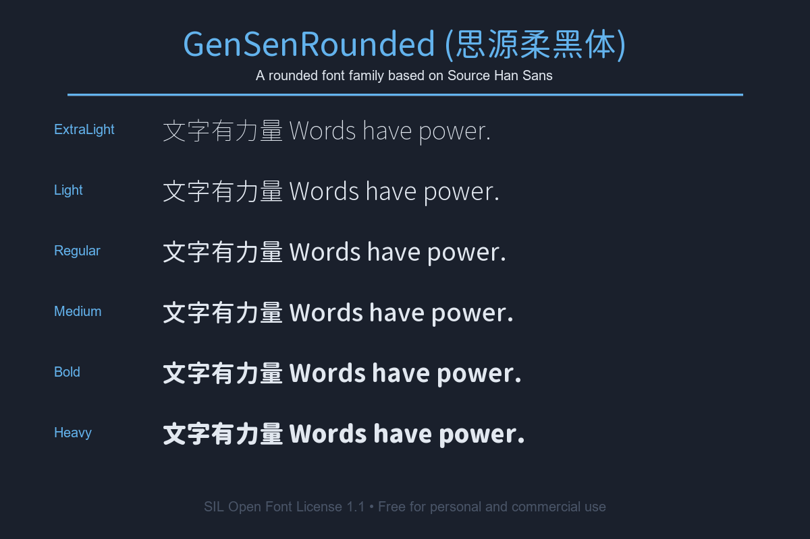

# GenSenRounded (思源柔黑体)

这是一个基于 Adobe 和 Google 的 [Source Han Sans](https://github.com/adobe-fonts/source-han-sans) (思源黑体) 修改而来的圆体字体。

> [!NOTE]
> **免责声明:** 我不是这些字体的原作者。这个 GitHub 仓库是我为了个人方便使用而创建的镜像。所有版权归原作者所有。

## 字体预览

## 字体文件

这个项目包含了以下字体文件：

- `GenSenRounded-B.ttc` (粗体)
- `GenSenRounded-EL.ttc` (特细体)
- `GenSenRounded-H.ttc` (特粗体)
- `GenSenRounded-L.ttc` (细体)
- `GenSenRounded-M.ttc` (中等)
- `GenSenRounded-R.ttc` (标准)

## 开源协议 (SIL Open Font License 1.1)

本字体采用 SIL Open Font License 1.1 (SIL 开源字体许可证 1.1) 进行授权。这是一个自由、开源的字体授权协议。以下是协议内容的简要说明：

### 您可以：

- **自由使用**：将字体用于任何个人、学术或商业用途，无需支付任何费用。
- **自由分享**：复制、分发字体文件给任何人。
- **自由修改**：基于此字体创作出新的衍生字体。
- **与软件捆绑**：将字体与任何软件一起打包、重新分发或销售，只要您在软件中包含了版权声明和开源协议。

### 您不可以：

- **单独销售字体**：您不能单独销售原始或修改过的字体文件本身。
- **使用保留字体名称**：在未经版权持有人书面许可的情况下，任何修改过的版本都不能使用“Source”等保留字体名称。
- **使用其他授权**：修改后的字体必须同样基于 SIL Open Font License 1.1 进行分发，不能更改为其他任何授权方式。

> [!IMPORTANT]
> 使用此字体创作的任何文件（例如：设计稿、PDF 文件、网站或图片）**不受**此授权条款的约束。您可以自由地使用、发布和拥有您自己的创作成果。

详细的授权内容请参考 `SIL_Open_Font_License_1.1.txt` 和 `LICENSE_OFL.txt` 文件。
